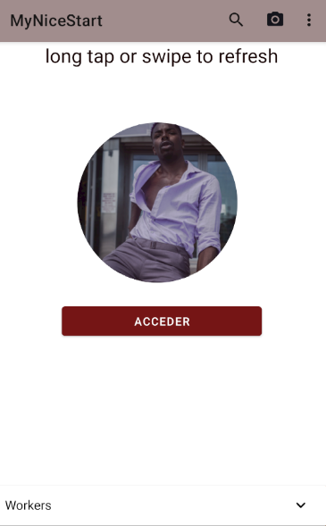

# MyNiceStart
[MyNiceStart en github](https://github.com/PabloSC900/MyNiceStart)

La idea principal de esta aplicación consiste en una plataforma digital que sirva como guia para encontrar restaurantes y locales de estilo asiatico en tu ciudad.
Las imagenes usadas estan pensadas de manera que le impriman ese caracter exotico para atraer al cliente, ademas de dejar clara la función principal de la app.
Los colores elgidos buscan armonizar con esta idea para que, al integrarlos junto con las imagenes, creen una "única paleta".

**Índice:**

* Splash
* Log In
* Sign Up
* Main
* Main2

**Splash**

La pantalla de Splash cuenta con:
* **Una ImageView**: para darle fondo.
* **Un VectorAsset**: sirve como logo para la aplicación

**Log In**

La pantalla de Log In cuenta con:
* **Una ImageView**: para darle fondo.
* **Dos EditText**: para introducir usuario y contraseña
* **Un Button**: te permite acceder a la pestaña Main
* **Un TextView**: te redirige a la pestaña de Sign Up

**Sign Up**

La pantalla de Sign Up cuenta con:
* **Una ImageView**: para darle fondo.
* **Tres EditText**: para introducir correo, usuario y contraseña
* **Un Button**: actualmente sin función
* **Un TextView**: te redirige a la pestaña de Log In

**Main**

La pantalla de Main cuenta con:
* **Un Button**: te permite acceder al Main2

**Main2**

La pantalla de Main2 tan solo uenta con una opción para volver a la panatalla Main, al pulsar la flecha situada en la parte superior izquierda

